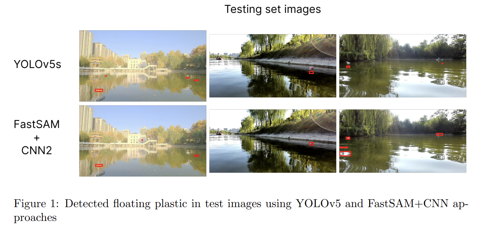
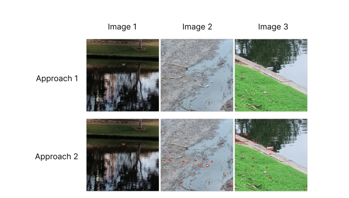

# Detecting plastic in rivers

Plastic pollution is a significant threat to the Earth's ecosystem, particularly when it reaches the oceans via rivers. Detecting and preventing plastics from entering oceans is more manageable within river environments. This project aimed to identify floating plastics in river images to combat oceanic plastic pollution. The goal was to enhance the YOLOv5 baseline's detection accuracy for plastic bottles, which was initially around 5%.
Two datasets, Trash Annotated in Context and KILI Plastic in Rivers, were utilized for training, validation, and testing. Additionally, the Plastic Bottles in Rivers dataset assessed the model's generalizability. The model utilized 5759 images with 15185 annotations of labelled trash.

The project comprised two main stages: object detection and binary classification (floating plastic vs. background). The first approach involved training YOLOv5 nano and small models, integrating object detection and classification into a single step. The second approach employed Fast Segment Anything Model  for image segmentation, followed by detecting floating plastics in the segmented objects.
Upon evaluation, the first approach demonstrated better performance on training and validation sets. However, the second approach exhibited greater versatility, successfully detecting plastic in diverse environmental conditions achieving a recall of nearly 51%.

To test the implementation model on realistic images, images from **River Torrens, Adelaide** were captured to test the plastic detector accuracy. Following image shows results obtained from YOLOv5 and proposed approach utilizing FastSAM

To read more about the details of implementation please refer to the [report](#detecting-plastic-in-rivers).